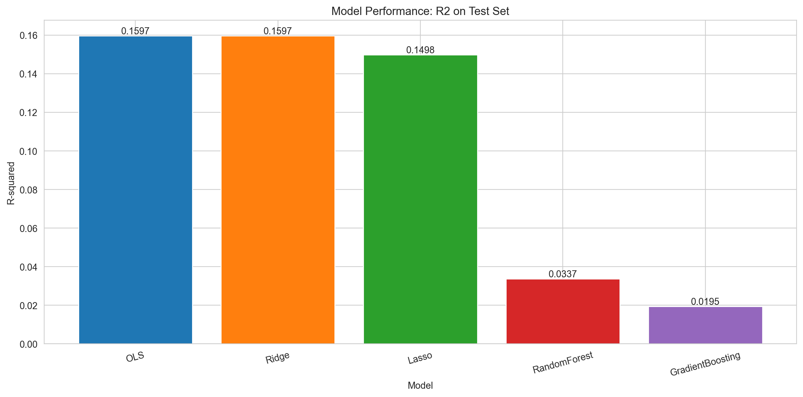

# Statistical Learning for Next-Month Stock Returns

A Python panel-modeling project with explicit next-month targets, chronological validation and auditable saved predictions. OLS, Ridge, Lasso, Random Forest and Gradient Boosting run with the core dependencies; a TensorFlow neural network is optional.

The checked-in showcase uses **synthetic data**. It demonstrates an executable research workflow, not observed stock-picking performance. Older same-month proxy results and test-selected winner claims have been replaced. The public proxy sample remains available for a separate, qualified demonstration.



## Run and verify

Python 3.11+:

```bash
python -m venv .venv
# Activate .venv using your shell's activation command.
python -m pip install -r requirements.txt
python -m unittest discover -s tests -v
python -m src.fa590_stock_return_prediction.run --skip-neural-network
python scripts/verify_outputs.py --output-dir outputs/latest_run
```

To include the sixth model, install `requirements-neural-network.txt` and omit `--skip-neural-network`. Core tests and GitHub Actions do not require TensorFlow.

Regenerate the checked-in synthetic showcase:

```bash
python -m src.fa590_stock_return_prediction.run --skip-neural-network --demo-months 36 --demo-stocks 80 --output-dir sample_outputs
python scripts/verify_outputs.py --output-dir sample_outputs
```

## Target and validation controls

`DATE` is the feature month end. `RET` is the following calendar month's response and `target_DATE` records when that response is realized. Raw inputs containing only `permno`, `DATE` and same-month `RET` are shifted by security; missing calendar months and last observations cannot become one-month targets. Prepared inputs with `target_DATE` are validated and are never shifted twice.

The split uses the first 60% of feature months for training, the next 20% for validation and the last 20% for testing. Boundary rows whose labels reach the next split's first forecast origin are purged. Predictors receive past-only forward fills; medians, industry categories and scaling parameters use training observations only. Features absent throughout training are excluded. Model choice uses the lowest **validation MSE**, with an alphabetical tie rule, before the selected model's test results are read.

All models' test diagnostics remain visible. Reporting every fixed model does not make a test-selected winner acceptable. This implementation uses fixed model hyperparameters and reports the validation-selected model without selecting a separate final-test portfolio winner.

## Input provenance

| Input | Meaning and limitation |
| --- | --- |
| Default generated panel | Explicitly synthetic next-month outcomes; no market evidence |
| `sample_data/public_proxy_sample.csv` | Existing historical characteristics sample with same-month `mom1m` copied to `RET`; the runner aligns it to the next month |
| Proxy builder output | Next-month `mom1m` proxy with explicit target dates/source; not verified CRSP returns |
| WRDS merge output | Characteristics at month t joined to supplied CRSP return at t+1; publication lags and source accounting still require independent validation |
| Other supplied CSV | Labeled `supplied`, never automatically labeled validated real-market data |

Run the existing proxy separately:

```bash
python -m src.fa590_stock_return_prediction.run --skip-neural-network --data-path sample_data/public_proxy_sample.csv --data-kind public_proxy --output-dir outputs/proxy
```

Build explicitly aligned inputs:

```bash
python -m src.fa590_stock_return_prediction.prepare_datashare_proxy --zip-path /path/to/datashare.zip --out data/proxy.csv --max-permnos 600
python -m src.fa590_stock_return_prediction.prepare_wrds_merge --chars /path/to/datashare.csv --returns /path/to/crsp.csv --out data/merged.csv
```

Do not redistribute restricted market data. `target_source` is metadata and is excluded from predictors. `--data-kind` is a user-supplied provenance label, not independent source verification.

## Outputs and checks

Each run saves dated stock-level predictions, predictive metrics, top-quintile diagnostics, feature importance, charts and a summary with split ranges, input hash, runtime and configuration. `scripts/verify_outputs.py` independently recomputes MSE and top-quintile average outcomes, verifies exact calendar-month targets and split-label boundaries, and reconciles the selected model to validation scores.

`run_status.json` binds the current completed outputs by SHA-256, normalizing CSV/JSON line endings to LF for Windows/Linux checkouts and hashing binary charts exactly. A failed rebuild records `ERROR`, so old files cannot pass as a fresh successful run. Disabling the optional neural network removes its previous training-history chart. Each nonempty monthly population contributes its top quintile, including small supplied panels and `--demo-stocks` values below 20.

The equal-weight top forecast quintile is a gross research diagnostic. Its reported monthly mean/volatility ratio uses a zero hurdle and sample standard deviation; it is not an annualized excess-return Sharpe ratio. Transaction costs, shorting, liquidity, delistings and an investable historical universe are not modeled. Proxy response values do not establish portfolio returns.

Regression tests perturb future predictors and final-test scores, validate target gaps and duplicate rejection, and check the WRDS merge's forward horizon. GitHub Actions tests the core pipeline, reconciles the saved synthetic showcase and builds a fresh synthetic run.

## Files

- `src/fa590_stock_return_prediction/panel.py`: target timing, train-only preprocessing and selection controls
- `src/fa590_stock_return_prediction/pipeline.py`: model fitting and diagnostics
- `sample_outputs/`: regenerated synthetic showcase and prediction records
- `notebooks/fa590_stock_return_prediction.ipynb`: historical classroom reference; outputs cleared, superseded by the tested runner

The implementation does not establish point-in-time availability of the public characteristics, historical universe membership or reproducible investment alpha. It is an educational portfolio project, not a live strategy. Candidate understanding and independent review remain necessary.
